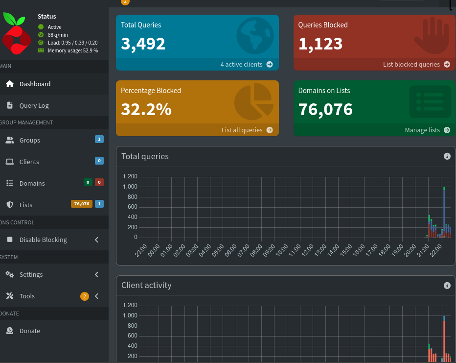

# 🔓 Campus Firewall Bypass & Secure DNS Sinkhole
**Project Status:** Active | **Type:** Network Security Research | **Stack:** Linux, Tailscale, Pi-hole


> ⚠️ **DISCLAIMER: FOR EDUCATIONAL & RESEARCH PURPOSES ONLY**
> This project is a Proof of Concept (PoC) designed to study network isolation vulnerabilities and privacy risks on public/university networks. It demonstrates how "Overlay Networks" (like Tailscale) can traverse restrictive NAT/Firewall rules. The author advocates for responsible network usage.

---

## 🧪 Research Motivation: Why This Exists

### 1. The "Hostile Network" Problem
University and Public WiFi networks are often treated as "trusted" zones, but they are hostile environments.
* **The Zero-Day Threat:** On a shared campus network, a device is visible to thousands of other students. Without strict isolation, "Malvertising" (malicious ads) can compromise a device within minutes.
* **Privacy Leaks:** Standard ISPs and University routers log DNS queries, creating a permanent record of every site a student visits.

### 2. Why Commercial Solutions Failed
I evaluated standard market solutions before engineering this custom infrastructure. They were insufficient for this specific environment:

| Solution | Why it Failed in this Scenario |
| :--- | :--- |
| **AdGuard / Local VPN Apps** | Mobile OSs only allow **one** VPN connection at a time. Using AdGuard prevents me from connecting to my actual University Lab VPN or Work VPN. It also drains significant battery. |
| **Browser Extensions** | They only protect the web browser. They leave the OS, background apps, and games completely exposed to tracking and ads. |
| **Physical Pi-hole** | I could not plug a Raspberry Pi into the dorm Ethernet because **Client Isolation** (a security feature on Uni routers) blocks my phone from talking to the Pi. |

---

## 💡 The Engineering Solution
To solve this, I engineered a **Hybrid-Cloud Bypass** using:

1.  **Virtualization:** Hosting the security core (Pi-hole) in a Linux VM inside my daily-driver laptop.
2.  **Tunneling:** Using **Tailscale (WireGuard Protocol)** to punch a hole through the University's NAT and Client Isolation.
3.  **Split-Horizon DNS:** Routing *only* DNS requests through the tunnel to minimize latency, while keeping heavy file downloads on the local network.

---

## ⚙️ Under the Hood: Technical Implementation

  

### 1. 🧠 The Core (Linux VM)
* **Hypervisor Environment:** Virtualized Kali Linux via VMware.
* **Resource Efficiency:** Tuned for minimal footprint (`1 vCPU`, `512MB RAM`) to execute silently in the background.
* **🛡️ Security Hardening (`ufw`):**
    ```bash
    # Deny public traffic (Prevents lateral movement attacks)
    sudo ufw deny incoming on eth0 
    
    # Allow VPN traffic (Only my devices)
    sudo ufw allow in on tailscale0
    ```

### 2. 🚇 The Tunnel (Tailscale Mesh)
* **NAT Traversal:** Leveraged **DERP Relay Servers** to establish peer-to-peer connections even behind strict University CGNAT and Double-NAT layers.
* **MagicDNS:** Configured *Global Nameservers* to enforce a "Split-Horizon" DNS strategy:
    > **Note:** All connected clients are forced to use the VM's Tailscale IP (`100.x.x.x`) for DNS resolution, overriding local ISP defaults.

### 3. 🛑 The Engine (Pi-hole FTL)
* **Blocklists:** Aggregated **100,000+ domains** via StevenBlack & Spam404 lists.
* **Regex Filtering:** Custom filters implemented to target CNAME-cloaked tracking domains.

---

## 📸 Proof of Concept

| **1. Network Traffic Analysis** |
| :---: |
|  |
| *Real-time blocking metrics on the secure dashboard* | 

---

## 🚀 Impact & Performance Results
* 🛡️ **Privacy Preserved:** **100k+** tracking domains and telemetry endpoints neutralized.
* ⚡ **100% Uptime:** Maintained connectivity on "hostile" networks where standard device-to-device communication is blocked.
* 🔒 **Zero-Trust Security:** Successfully eliminated "malvertising" vectors without exposing open ports (`53` or `80`) to the public internet.

---

## 🔮 Roadmap & Future Improvements
- [ ] **Recursive DNS (Unbound):** Eliminate reliance on upstream providers (Google/Cloudflare).
- [ ] **Containerization (Docker):** Migrate the VM infrastructure to a `docker-compose` stack.
- [ ] **Observability Stack:** Implement **Grafana + Prometheus** for hardware monitoring.

---
*Maintained by HASIB*
